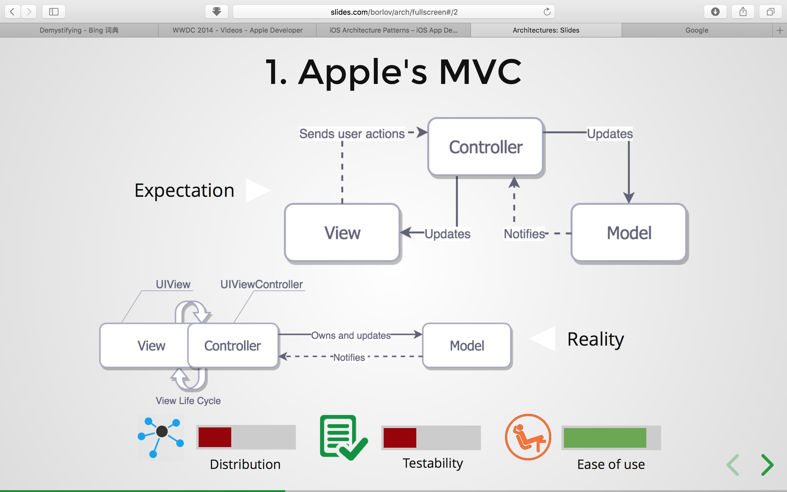
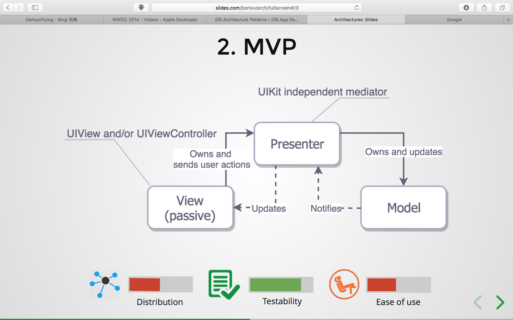
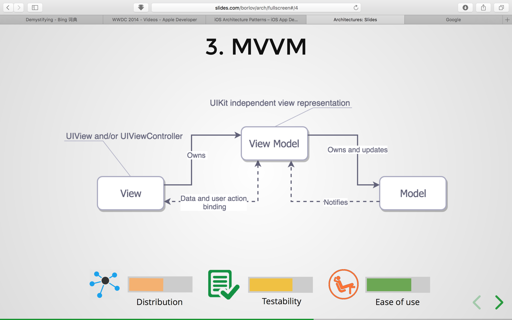
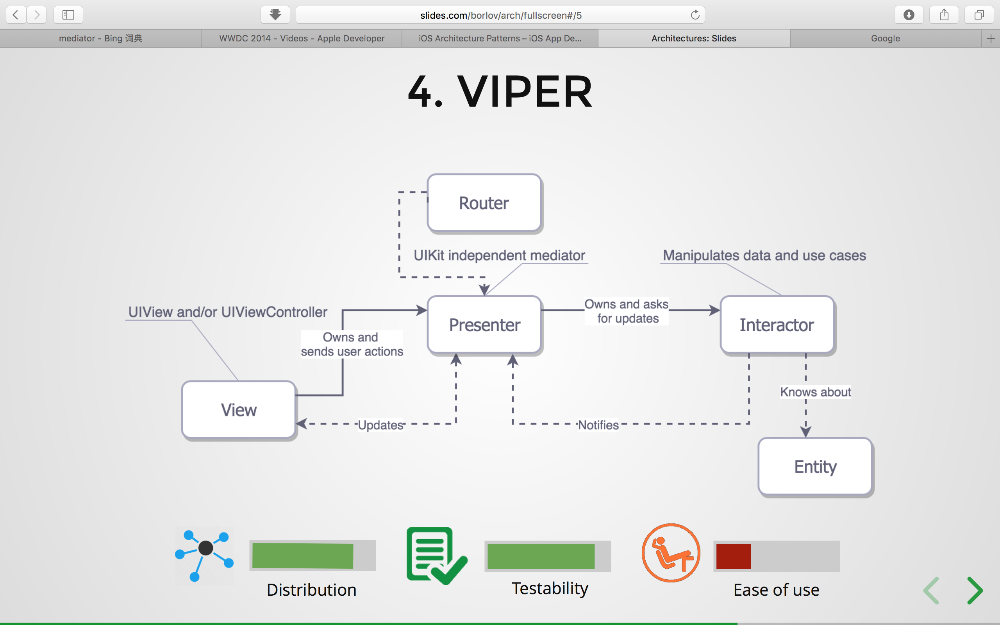

# iOS App Architectures / Design Patterns

## Why care about architecture?

1. Distribution
   The best way to defeat complexity is to divide responsibilities among multiple entities following the single responsibility principle.
   
2. Testability
   The tests saved us from finding issues in runtime, which might happen when an app is on a user's device and the fix takes time to reach the user.
   
3. Ease of use
   The less code you have, the less bugs you have.

## MV(X)

* Models -- responsible for the domain data or a data access layer which manipulates the data, think of `Person or PersonDataProvider` classes.

* Views  -- responsible for the presentation layer (GUI), UI prefix

* Controller/Presenter/ViewModel -- the glue or the mediator between Model and View, in general responsible for altering the Model by reacting to the user's actions performed on the View and updating the View with changes from Model.

### MVC
The __View__ and the __Model__ in fact separated, but the __View__ and the __Controller__ are tightly coupled.



### MVP -- Cocoa MVC's promises delivered
The MVP's mediator, __Presenter__, has nothing to do with the life cycle of the view controller, and the __View__ can be mocked easily, so there is no layout code in the __Presenter__ at all, but it is responsible for updating the __View__ with data and state.

In terms of the MVP, the UIViewController subclasses are in fact the Views and not the Presenters. This distinction provides superb testability, which comes at cost of the development speed, because you have to make manual data and event binding.



### MVVM (Model-View-ViewModel)
- The MVVM treats the view controller as the __View__.
- There is no tight coupling between the __View__ and the __Model__.
- __ViewModel__ is basically UIKit independent representation of your __View__ and its state.
- The __ViewModel__ invokes changes in the __Model__ and updates itself with the updated __Model__, and since we have a binding between the __View__ and the __ViewModel__, the first is updated accordingly.



#### MVVM Demo code (more demo code see these .playground)
```Swift
import UIKit

struct Person { // Model
	let firstName: String
	let lastName: String
}

protocol GreetingViewModelProtocol: class {
	var greeting: String? { get }
	var greetingDidChange: ((GreetingViewModelProtocol) -> Void)? { get set }	// callback
	init(person: Person)
	func showGreeting()
}

class GreetingViewModel: GreetingViewModelProtocol {
	let person: Person
	
	// MARK: - GreetingViewModelProtocol
	var greeting: String? {
		didSet {
			self.greetingDidChange?(self)
		}
	}
	
	var greetingDidChange: ((GreetingViewModelProtocol) -> Void)?
	
	required init(person: Person) {
		self.person = person
	}
	
	@objc func showGreeting() {
		self.greeting = "Hello" + " " + self.person.firstName + " " + self.person.lastName
	}
}

class GreetingViewController : UIViewController {
	
	var viewModel: GreetingViewModelProtocol! {
		didSet {	// set up bindings
			self.viewModel.greetingDidChange = { [unowned self] vm in
				self.greetingLabel.text = vm.greeting
			}
		}
	}
	
	let showGreetingButton = UIButton()
	let greetingLabel = UILabel()
	
	override func viewDidLoad() {
		super.viewDidLoad()
		showGreetingButton.addTarget(self.viewModel, action: #selector(GreetingViewModel.showGreeting), for: .touchUpInside)
	}
	
	// layout code goes here
}

// Assembling of MVVM
let model = Person(firstName: "Kevin", lastName: "Durant")
let viewModel = GreetingViewModel(person: model)
let vc = GreetingViewController()
vc.viewModel = viewModel
```

### Bindings
Bindings come out of box for the mac OS X development, but we don't have them in the iOS toolbox. Of course we have the __KVO__ and __Notifications__, but they aren't as convenient as bindings. 

Here we have two options:

-1. One of the __KVO__ based binding libraries like the [RZDataBinding](https://github.com/Raizlabs/RZDataBinding) or the [Swift Bond](https://github.com/ReactiveKit/Bond).

-2. The full scale functional reactive programming beasts like ReactiveCocoa, [RxSwift](https://github.com/ReactiveX/RxSwift) or [PromiseKit](https://github.com/mxcl/PromiseKit).

## VIPER
[VIPER Detail](https://www.objc.io/issues/13-architecture/viper/)

* Interactor — contains business logic related to the data (Entities) or networking, like creating new instances of entities or fetching them from the server.
* Presenter - contains the UI related (but UIKit independent) business logic, invokes methods on the Interactor.
* Entities - your plain data objects, not the data access layer, because that is a responsibility of the Interactor.
* Router - responsible for the segues between the VIPER modules.



## MV(X) vs. VIPER
* __Model__ (data interaction) logic shifted into the __Interactor__ with the __Entities__ as dumb data structures.
* Only the UI representation duties of the __Controller/Presenter/ViewModel__ moved into the __Presenter__, but not the data altering capabilities.
* __VIPER__ explicitly addressed navigation responsibility by the __Router__

Happy coding :+1:  :sparkles:
